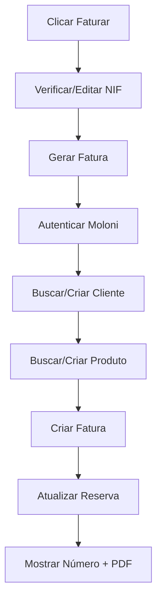

# 🧾 Configuração da Integração Moloni

Guia completo para configurar a integração de fatoração automática com Moloni.

## 🔑 1. Obter Credenciais Moloni

### Passo 1: Criar Aplicação na Moloni

1. Acede a [developers.moloni.pt](https://developers.moloni.pt)
2. Faz login com a tua conta Moloni
3. Vai a **"As Minhas Aplicações"** > **"Criar Nova Aplicação"**
4. Preenche os dados:
   - **Nome:** Brooklyn Barbearia
   - **Tipo:** Web Application
   - **Redirect URI:** `https://brooklynbarbearia.pt` (opcional)

### Passo 2: Copiar Credenciais

Depois de criar, vais receber:
- **Client ID** (ex: `abc123def456`)
- **Client Secret** (ex: `xyz789uvw012`)

⚠️ **Guarda estas credenciais em local seguro!**

### Passo 3: Obter Company ID

1. Acede à tua conta Moloni
2. Vai a **Definições** > **Dados da Empresa**
3. O **Company ID** é o número que aparece no URL:
   ```
   https://www.moloni.pt/[COMPANY_ID]/dashboard
   ```

---

## 🔧 2. Configurar Variáveis de Ambiente

### Cloudflare Pages

1. Vai ao dashboard Cloudflare Pages
2. Seleciona o projeto **barbearia-brooklyn**
3. Vai a **Settings** > **Environment Variables**
4. Adiciona as seguintes variáveis:

| Variável | Valor | Descrição |
|----------|-------|-------------|
| `MOLONI_CLIENT_ID` | `abc123def456` | Client ID da aplicação |
| `MOLONI_CLIENT_SECRET` | `xyz789uvw012` | Client Secret da aplicação |
| `MOLONI_USERNAME` | `teu@email.pt` | Email de login Moloni |
| `MOLONI_PASSWORD` | `tua_password` | Password de login Moloni |
| `MOLONI_COMPANY_ID` | `12345` | ID da empresa Moloni |

⚠️ **Importante:**
- Configura para **Production** e **Preview** environments
- Nunca commites estas credenciais no código!
- Usa passwords fortes e únicas

### Opcional: Cloudflare KV (Cache de Tokens)

1. Cria um KV Namespace chamado `MOLONI_TOKENS`:
   ```bash
   wrangler kv:namespace create "MOLONI_TOKENS"
   ```

2. Adiciona o binding em `wrangler.toml`:
   ```toml
   [[kv_namespaces]]
   binding = "MOLONI_TOKENS"
   id = "YOUR_KV_ID"
   ```

---

## 📦 3. Executar Migrations

### Opção A: Via Cloudflare Dashboard (Recomendado)

1. Vai ao dashboard Cloudflare
2. Seleciona **Workers & Pages** > **D1**
3. Escolhe a database **barbearia-db**
4. Vai a **Console**
5. Cola e executa o SQL de `migrations/add_moloni_fields.sql`:

```sql
ALTER TABLE reservas ADD COLUMN moloni_document_id INTEGER;
ALTER TABLE reservas ADD COLUMN moloni_document_number TEXT;
CREATE INDEX idx_reservas_moloni_document ON reservas(moloni_document_id) 
  WHERE moloni_document_id IS NOT NULL;
```

### Opção B: Via Wrangler (Local)

```bash
wrangler d1 execute barbearia-db --file=migrations/add_moloni_fields.sql
```

---

## ✅ 4. Testar Integração

### Teste Básico

1. Faz login no admin: `https://brooklynbarbearia.pt/admin/`
2. Vai ao **Calendário**
3. Clica numa reserva **concluída**
4. Clica em **"Faturar"**
5. Verifica/edita o NIF do cliente
6. Clica em **"Gerar Fatura"**

### Resultado Esperado

✅ Deve aparecer:
- Mensagem de sucesso
- Número da fatura (ex: "FT 2025/123")
- Link para PDF da fatura
- Fatura visível no portal Moloni

### Troubleshooting

#### Erro: "Não autorizado"
- Verifica se as credenciais estão corretas
- Confirma que o username/password são da conta Moloni

#### Erro: "Cliente não encontrado"
- O cliente será criado automaticamente na Moloni
- Verifica se o NIF é válido (9 dígitos)

#### Erro: "Serviço não encontrado"
- O serviço será criado automaticamente na Moloni
- Verifica se o preço do serviço é válido

---

## 📊 5. Fluxo Completo



---

## 📝 6. Campos de Base de Dados

### Tabela `reservas`

| Campo | Tipo | Descrição |
|-------|------|-------------|
| `moloni_document_id` | INTEGER | ID do documento na Moloni |
| `moloni_document_number` | TEXT | Número formatado (ex: "FT 2025/123") |

### Tabela `clientes`

| Campo | Tipo | Descrição |
|-------|------|-------------|
| `nif` | TEXT | NIF do cliente (9 dígitos) |

---

## 🔒 7. Segurança

### Tokens
- Tokens Moloni são cacheados em KV por 1 hora
- Refresh automático antes de expirar
- Re-autenticação automática se refresh falhar

### Autenticação
- Endpoint `/api/admin/moloni/create-invoice` requer token admin
- Validação de NIF no frontend e backend
- Dados sensíveis nunca são logados

---

## 📚 8. Documentação Moloni

- **API Docs:** [developers.moloni.pt/api](https://developers.moloni.pt/api)
- **Guias:** [developers.moloni.pt/docs](https://developers.moloni.pt/docs)
- **Suporte:** [suporte@moloni.pt](mailto:suporte@moloni.pt)

---

## ✨ 9. Funcionalidades Futuras

- [ ] Faturas Proforma (orçamentos)
- [ ] Notas de crédito
- [ ] Envio automático de faturas por email
- [ ] Relatórios de fatoração
- [ ] Integração com recibos de pagamento

---

## 👨‍💻 Suporte

Problemas com a integração?
1. Verifica o console do browser (F12)
2. Verifica logs do Cloudflare Workers
3. Contacta suporte Moloni se necessário

---

**Última atualização:** 29 de Dezembro de 2025
